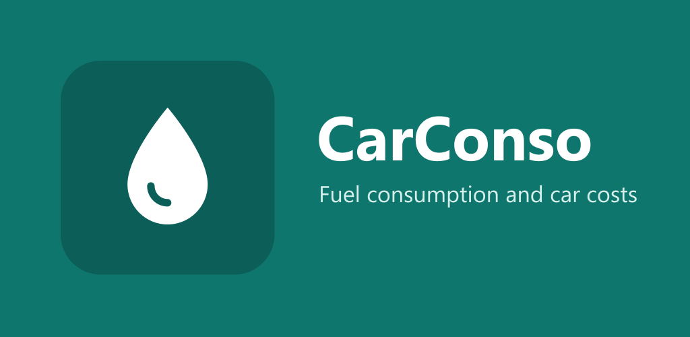

<p align="center">
  
</p>

<p align="center">
  <strong>Fuel consumption and cost tracker for your car</strong><br>
  Simple, offline, no account, no ads. In English and French.
</p>

<p align="center">
  <a href="https://atrena.github.io/CarConso/">Web app</a> ·
  <a href="https://github.com/Atrena/CarConso/releases/latest">Download the APK</a> ·
  <a href="https://atrena.github.io/CarConso/privacy.html">Privacy</a> ·
  <a href="README.fr.md">Version française</a>
</p>

---

## Features

| | |
|---|---|
| ⛽ **Fill-ups** | Volume, price, odometer or distance, partial fill-ups, blends of compatible fuels (e.g. E10 + E85). |
| 🚗 **Several vehicles** | Petrol or diesel, tank capacity, fuels offered, default fuel. |
| 🔧 **Expenses** | Service, insurance, tolls… one-off or recurring (monthly, yearly…). |
| 📊 **Statistics** | Average consumption, cost per km or mile, comparison by fuel, monthly spending, forecast, period filter. |
| 🧮 **Simulator** | Which fuel is cheapest per 100 km at today's pump prices, and the E85 break-even price. |
| 🌍 **Language and country** | English or French, detected automatically. The country sets the local fuel names and list (SP-95 in France, Regular / Premium in the US, Super E10 in Germany…) and the default units. |
| 🎨 **Customisation** | Light / dark theme, colour, text size, compact layout, units (L/100 km, km/L, mpg, km or miles, litres or US gallons, currency), start screen, visible tabs. |
| 💾 **Data** | Backup / restore to a file, CSV exports for Excel. In the Android app: automatic backup with the phone's Google backup. |

Supported countries: France, Belgium, Luxembourg, Switzerland, Canada, United Kingdom,
Ireland, United States, Germany, Austria. Other countries use international fuel names.

## Privacy

No data is collected: no account, no server, no usage analytics. Everything stays on
your device, and the Android app asks for no permission. Details:
[privacy policy](https://atrena.github.io/CarConso/privacy.html).

## Installation

- **Android**: download the APK from the [latest release](https://github.com/Atrena/CarConso/releases/latest)
  (installing apps from unknown sources must be allowed). Coming soon to Google Play.
- **iPhone, computer, or Android without installing**: open the
  [web app](https://atrena.github.io/CarConso/), then add it to the home screen
  (Chrome: menu ⋮ › *Install app*; Safari: Share › *Add to Home Screen*).

The web app and the Android app keep separate data: to move from one to the other, use
*Settings › Data › Full backup*, then *Restore from a file*.

## How consumption is calculated

CarConso uses the **fill-to-fill** method:

- the distance entered is the one driven **since the previous fill-up**;
- the litres of a full fill-up replace exactly what was burned over that distance;
  partial fill-ups add up until the next full one;
- the first full fill-up is only a **reference** (its distance is optional): the first
  consumption appears at the next one;
- the consumption is credited to the fuel **that was in the tank** (the previous fill-up's),
  which makes comparisons between fuels and blends reliable;
- the cost of a trip uses the price paid for that fuel, so the cost per km never counts
  the fuel still in the tank.

## Development

The app is plain HTML, CSS and JavaScript, with no framework and no build step.
The same code runs the website (GitHub Pages, from the `main` branch) and the Android
app (through [Capacitor](https://capacitorjs.com/)).

```
index.html, style.css      user interface
i18n.js                    translations, countries, fuel names
stats.js                   calculations (consumption, blends, forecast, simulator)
storage.js                 local storage, settings, import / export
native.js                  Android-only features
app.js, *-view.js          screens (Fill-up, History, Expenses, Stats, Simulator, Settings)
vendor/                    Chart.js
android/                   Android project (Capacitor)
assets/, store/            icons, splash screen, Google Play images and listing (store/PLAY_STORE.md)
```

### Web app

```powershell
powershell -ExecutionPolicy Bypass -File serve.ps1
```

then open <http://localhost:8000>.

### Android app

Requirements: Node.js, JDK 21 and Android Studio (Android SDK).

```bash
npm install
npm run android          # runs the app on a connected phone or the emulator
npm run android:bundle   # .aab file for Google Play
```

Signing uses `android/keystore.properties` and a `.jks` key, which are never pushed to GitHub.

### Translations

All texts live in `i18n.js` (`MESSAGES.fr` and `MESSAGES.en`), and the static texts of
`index.html` are tagged with `data-i18n`. Fuel names and default units per country are
in `COUNTRIES`. Contributions for new languages or countries are welcome.

## License

CarConso is free software released under the [GNU GPL v3](LICENSE) (or any later version):
you may use, study, modify and share it, as long as modified versions stay under the same license.

## Credits

Designed by [Atrena](https://github.com/Atrena), built with help from
[Claude](https://claude.ai) (Anthropic). Charts: [Chart.js](https://www.chartjs.org/) (MIT license).
